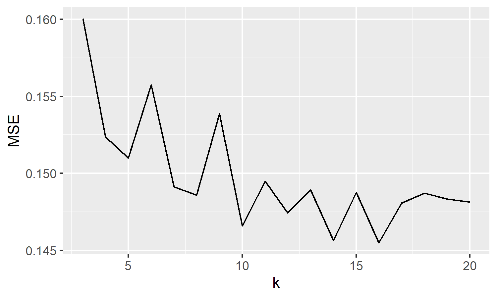

```{r setup, include=FALSE}
knitr::opts_chunk$set(
  echo = TRUE,
  fig.width = 5,
  message=FALSE, 
  warning=FALSE)
library(dplyr)
library(Hmisc)
library(magrittr)
library(readr)
library(ggplot2)
library(ISLR2)
library(class)
library(ggpubr)
library(corrplot)
library(GGally)
library(PreProcess)
library(caTools)
library(caret)
library(GGally)
library(PreProcess)
library(tree)         #tree/CART
library(MASS)
library(mclust)       #Gaussian Mixtures
library(car)
library(boot)         #CV
library(e1071)
library(leaps)
library(glmnet)
library(pls)
library(gridExtra)
library(mgcv)         #GAM
library(randomForest) #Random Forest
#Reading CSV files
Absence_df<- readr::read_csv("Absenteeism_at_work  UCI.csv")
Absence_df2018<- readr::read_csv("Absenteeism_new_data.csv")

#Summary of Dataset
selected <- c("Distance_from_Residence_to_Work","Service_time", "Age",
              "Work_load_Average/day_","Hit_target","Weight","Height",
              "Absenteeism_time_in_hours","Transportation_expense")
#Change the Colnames
colnames(Absence_df) <- c('ID', 'Reason', 'Month', 'Day', 
'Seasons','Tran_expense', 'Distance', 'Service_time', 'Age','Workload'
, 'Hit_target', 'Disciplinary_failure', 'Education', 'children', 'drinker'
, 'smoker', 'pet', 'weight', 'height', 'body_mass', 'hour')

median(Absence_df$hour) # median will be separate point that is 3
Absence_df <- mutate(Absence_df, Absence=ifelse(Absence_df$hour>3,1,0))

# Percent of Absence "True" Label
sum(Absence_df$Absence)/nrow(Absence_df)*100

#Columns that are totally empty
table(sapply(Absence_df,function(x)all(is.na(x))))
table(sapply(Absence_df2018,function(x)all(is.na(x))))

#Columns with NA 
table(lapply(Absence_df,function(x){length(which(is.na(x)))}))
table(lapply(Absence_df2018,function(x){length(which(is.na(x)))}))

#Change null reasons with the mode
Absence_df$Reason[Absence_df$Reason %in% 0] =23

Absence_df<-dplyr::filter(Absence_df,Month!=0)

#Absence_df$Absence<-ifelse(Absence_df$Absence==0,"short", "long")
graph2 <- ggplot(Absence_df,aes(x=Reason,fill=factor(Absence)))+geom_bar(stat="count")+
  stat_count(geom = "text", colour = "black", size = 3.5,
aes(label = ..count..),position=position_stack(vjust=0.5))+
  labs( x = "Reason of Absence", y = "Count of reasons", fill = "Absence length")+scale_x_continuous(labels=Absence_df$Reason, breaks=Absence_df$Reason)

#Distribution of hour
graph3<-ggplot(Absence_df, aes(x=hour))+geom_bar()+
  ggtitle("Distribution of absence hour ")+theme_classic()
```

## Outline
 - Data exploration
 - Regression methods
 - Classification methods
 - Results
 - Discussion
 

\tiny 
### Code and Resources used
\tiny
 R version : 4.0.5
 Packages: dplyr, readr, ggplot2, class, randomForest[@r], boot, tree
 Dataset[@UCI]

 
## Motivation 
In following study we are going to address to one of the important workplace challenges that is absenteeism[@Kocakulah2016]. our aim is:

 - Focus on this as a measurable problem
 
 - Detect the relationship between predictors and response 
 
 - Build prediction models to predict Absenteeism time in Hours
 
 - Fit classification models to classify whether it is long or short absence

 
## Data 
Dataset is related to 740 records of absenteeism at work for three years (July 2007-July 2010) in a courier company in Brazil [^1]

  - There are 20 features/predictors in this dataset- without `NA`
  - The response/label is one continues column (hour)
  - `46%`of observations have absence hour more that median


\tiny
```{r, results='asis',echo=FALSE}
knitr::kable(head(Absence_df[,1:11]),caption = "Sample of Dataset",align=c("c","c","c","c","c","c","c","c","c","c"))
knitr::kable(head(Absence_df[,12:21]),align=c("c","c","c","c","c","c","c","c","c","c"))
```
[^1]:\tiny[\textit{UCI Machine Learning Repository}](http://archive.ics.uci.edu/ml/datasets/Absenteeism+at+work#)


## Data exploration by visualization

 - There are 28 Reasons that 23, 28, 27 and 13 have most count of absence in observations that are (medical and dental consultation, physiotherapy, musculeskeletal disorders)
 - Reasons 13,19 and 22 have the most long absence that need more investigation 
 - Height, weight and body_mass have a high collinearity based on correlation matrix


\tiny
{width=50%}|{width=50%}


## Methods- Classification

Target: finding the class of absence time length
 
 - Logistic Regression:
    - Best subset used for feature selection
    - confusion matrix for accuracy test accuracy is `77%`
    - K-fold CV applied with K=7
      
 - Classification tree
    - test accuracy `80.9%`
    - Pruning with optimal node 10 and`81.5%`+interpretable

\tiny    
{width=50%}|{width=40%}

```{r results='asis',echo=FALSE}
#grid.arrange(graph2, graph3, ncol = 1)
```
## Methods- Regression

Target: predicting the absence hours

- Multiple linear regression
     - $R^2=0.2$ and $RMSE=10.8$ $MAE=5.53$
     
   
- Regression tree
     - Number of terminal nodes is 16
     -  $R^2=0.07$ and $RMSE=14.62$ $MAE=6.38$

\tiny
{width=100%}|

## Results 

### In classification part for binary response variable:
 
 - The accuracy of regression tree is more than logistic regression
 - We applied LDA and Random forest and both have less accuracy
 - Because of high correlation between variables
 - VIF shows multicollinearity in body_mass, height, weight
 
### In Regression part for continuous response variable:
 
 - We are usign MAE and RMSE to compare models
 - The linear regression works better in this part
 


## Discussion 
- In regression part there is challenge for having huge number of feature
- Possible improvement by focusing more on feature selection
- Since the response label in balanced the stratification of data is not important

##

  \begin{center}
			\textbf{{\LARGE Thank You!}}
		\end{center}
		

## References 
