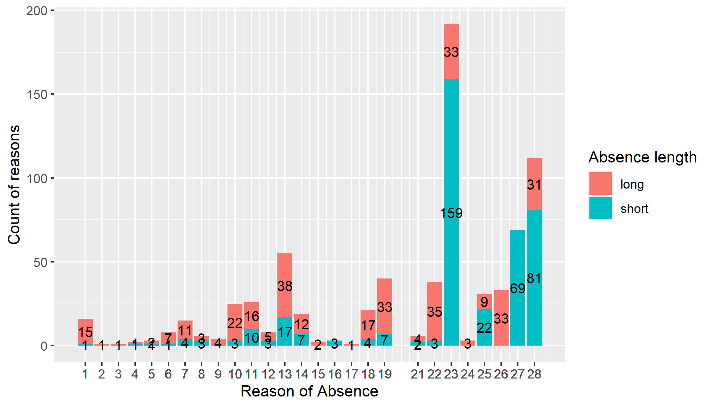
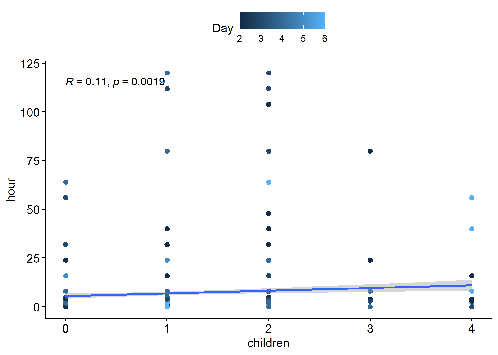
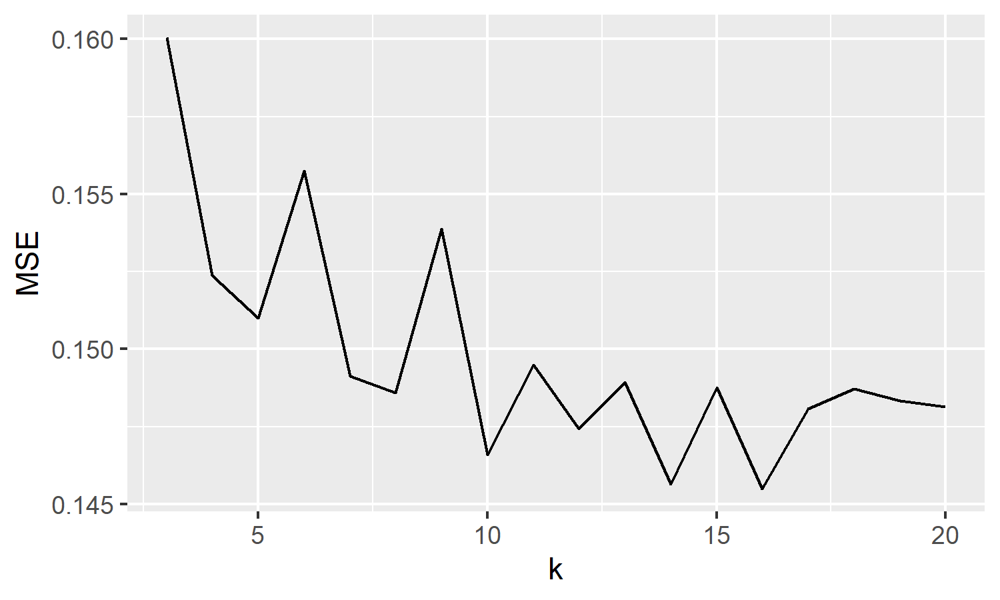
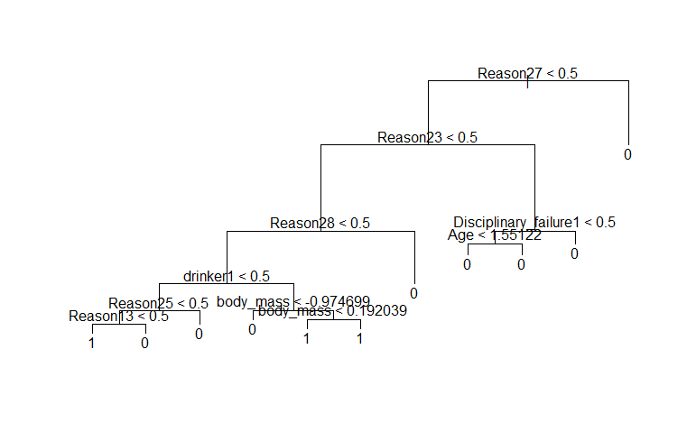

 Absenteeism at work prediction
================


```{r}
library(dplyr)
library(Hmisc)
library(magrittr)
library(readr)
library(ggplot2)
library(ISLR2)
library(class)
library(ggpubr)
library(corrplot)
library(GGally)
library(PreProcess)
library(caTools)
library(caret)
library(GGally)
library(PreProcess)
library(tree)         #tree/CART
library(MASS)
library(mclust)       #Gaussian Mixtures
library(car)
library(boot)         #CV
library(e1071)
library(leaps)
library(glmnet)
library(pls)
library(gridExtra)
library(mgcv)         #GAM
library(randomForest) #Random Forest
```

## Outline
 - Data exploration
 - Regression methods
 - Classification methods
 - Results
 - Discussion
 

### Code and Resources used
 R version : 4.0.5
 Packages: dplyr, readr, ggplot2, class, randomForest, boot, tree
 [Dataset](http://archive.ics.uci.edu/ml/datasets/Absenteeism+at+work#)

 
## Motivation 
In following study we are going to address to one of the important workplace challenges that is absenteeism. our aim is:

 - Focus on this as a measurable problem
 
 - Detect the relationship between predictors and response 
 
 - Build prediction models to predict Absenteeism time in Hours
 
 - Fit classification models to classify whether it is long or short absence

 
## Data 
Dataset is related to 740 records of absenteeism at work for three years (July 2007-July 2010) in a courier company in Brazil [^1]

  - There are 20 features/predictors in this dataset- without `NA`
  - The response/label is one continues column (hour)
  - `46%`of observations have absence hour more that median

[^1]:[\textit{UCI Machine Learning Repository}](http://archive.ics.uci.edu/ml/datasets/Absenteeism+at+work#)


## Data exploration by visualization

 - There are 28 Reasons that 23, 28, 27 and 13 have most count of absence in observations that are (medical and dental consultation, physiotherapy, musculeskeletal disorders)
 - Reasons 13,19 and 22 have the most long absence that need more investigation 
 - Height, weight and body_mass have a high collinearity based on correlation matrix


{width=50%}|{width=50%}


## Methods- Classification

Target: finding the class of absence time length
 
 - Logistic Regression:
    - Best subset used for feature selection
    - confusion matrix for accuracy test accuracy is `77%`
    - K-fold CV applied with K=7
      
 - Classification tree
    - test accuracy `80.9%`
    - Pruning with optimal node 10 and`81.5%`+interpretable

{width=50%}|{width=40%}

## Methods- Regression

Target: predicting the absence hours

- Multiple linear regression
     - $R^2=0.2$ and $RMSE=10.8$ $MAE=5.53$
     
   
- Regression tree
     - Number of terminal nodes is 16
     -  $R^2=0.07$ and $RMSE=14.62$ $MAE=6.38$

{width=100%}|

## Results 

### In classification part for binary response variable:
 
 - The accuracy of regression tree is more than logistic regression
 - We applied LDA and Random forest and both have less accuracy
 - Because of high correlation between variables
 - VIF shows multicollinearity in body_mass, height, weight
 
### In Regression part for continuous response variable:
 
 - We are usign MAE and RMSE to compare models
 - The linear regression works better in this part
 


## Discussion 
- In regression part there is challenge for having huge number of feature
- Possible improvement by focusing more on feature selection
- Since the response label in balanced the stratification of data is not important

##
		

## References 
